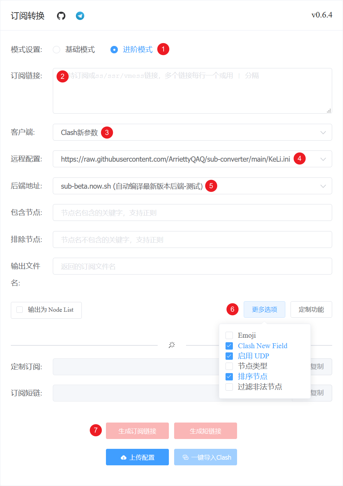
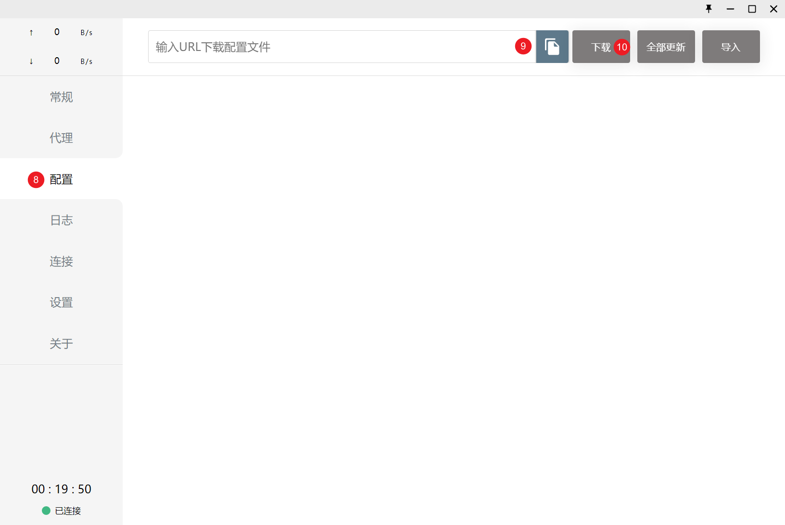
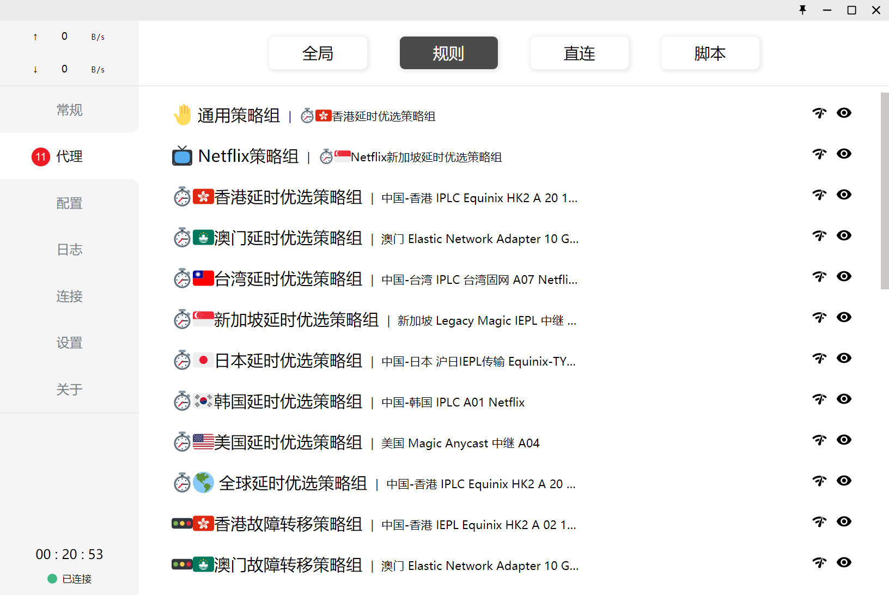
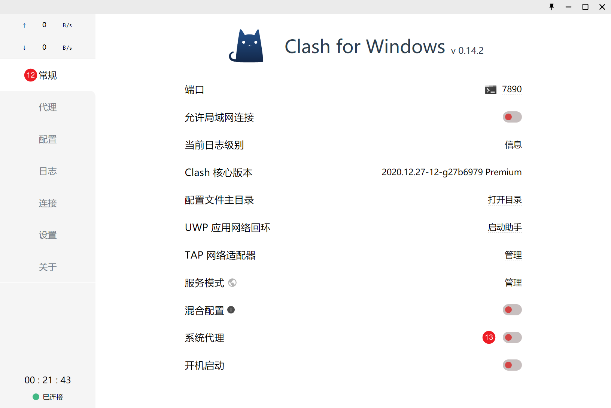

### 这是一个使用自定义转换模板的教程
### 文本序号顺序与图片序号标注一致

1. 见上图，选择 `进阶模式`；
2. 在订阅链接文本框内输入你的订阅链接，比如 `SS/SSR/V2Ray/Trojan/Clash` 等的订阅链接，此链接需要从你从机场的用户后台获取；
3. 选择 `Clash 新参数`；
4. 远程配置填入 `https://raw.githubusercontent.com/ArriettyQAQ/sub-converter/main/KeLi.ini`；

5. 后端地址选择 `sub-beta.now.sh（自动编译最新版本后端-测试）`；
6. 点击 `更多选项` ，勾选 `Clash New Field` `启用 UDP` `排序节点`；
7. 点击 `生成订阅链接`，复制生成的订阅链接后打开 `Clash for Windows` 客户端；

8. 点击 `配置`；
9. 点击 `粘贴` 按钮；
10. 点击 `下载`；

11. 点击 `代理`，检查转换的订阅结果是否如图一致；

12. 点击 `常规`；
13. 点击 `系统代理`；
14. 完成以上操作之后，你的电脑已经可以正常访问你所需要的服务了。